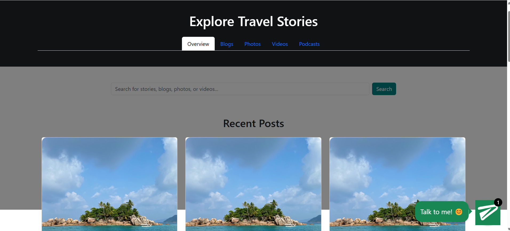
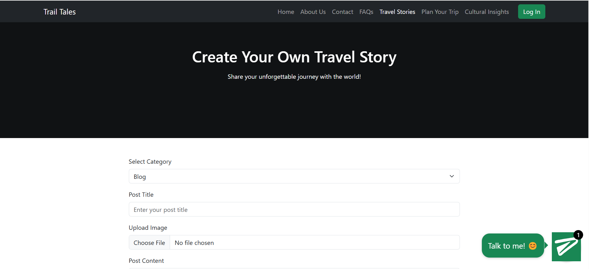
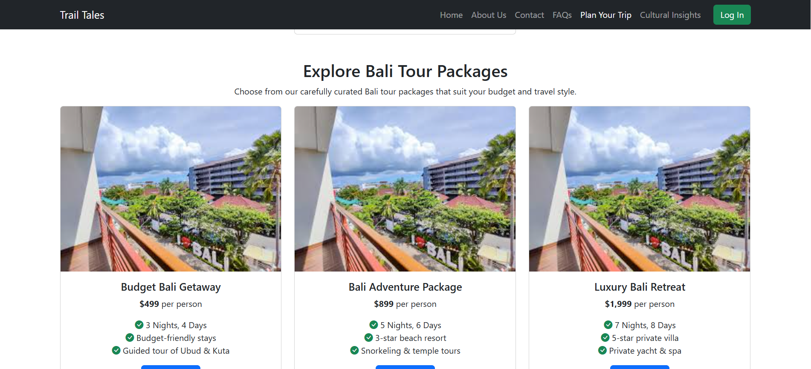

# We Trail Tales

## Overview

We Trail Tales is a comprehensive travel platform that enables users to explore diverse cultures, plan trips, and share their travel experiences through blogs, photos, videos, and podcasts. The platform also provides cultural insights, a chatbot, and a translation tool to enhance user engagement. Future enhancements include a leaderboard system where users can earn points for their contributions and redeem them for trip discounts.

## Features

- **User-Generated Content:** Users can create and share travel stories, including blogs, photos, videos, and podcasts.
- **Content Organization:** Posts are categorized and displayed collectively or by specific categories for better accessibility.
- **Trip Planning:** Users can plan their trips with curated recommendations and insights about various destinations.
- **Cultural Insights:** Provides historical and cultural details about different locations.
- **Chatbot & Translation Tool:** Enhances user experience by providing travel assistance and multilingual support.
- **Leaderboard System (Upcoming):** Users will accumulate points based on contributions, which can be redeemed for travel discounts.

## Tech Stack

- **Frontend:** HTML, CSS, JavaScript, Bootstrap
- **Backend:** Flask, Python
- **Database:** SQLite
- **Authentication & Storage:** Firebase
- **APIs:** External APIs for authentication and data retrieval

## Installation

### Prerequisites

Ensure you have the following installed:

- Python 3.x
- Flask
- SQLite
- Firebase Admin SDK credentials

### Setup Instructions

1. Clone the repository:
   ```sh
   git clone https://github.com/pankhuri92/Trail-Tales.git
   cd we-trail-tales
   ```
2. Create and activate a virtual environment:
   ```sh
   python -m venv venv
   source venv/bin/activate  # On Windows use `venv\Scripts\activate`
   ```
3. Install dependencies:
   ```sh
   pip install -r requirements.txt
   ```
4. Configure Firebase authentication:
   - Place your Firebase Admin SDK JSON file in the root directory.
   - Update `FIREBASE_WEB_API_KEY` in `app.py`.
5. Initialize the database:
   ```sh
   flask db upgrade  # Ensure tables are created
   ```
6. Run the application:
   ```sh
   python app.py
   ```
7. Access the application at `http://127.0.0.1:5000/`.

## Screenshots

| Feature        | Screenshot                           |
| -------------- | ------------------------------------ |
| Homepage       |       |
| Travel Stories |      |
| Create Post    |    |
| Trip Planning  |  |

## Contribution

Contributions are welcome! Follow these steps:

1. Fork the repository.
2. Create a new branch: `git checkout -b feature-branch`.
3. Commit your changes: `git commit -m "Added a new feature"`.
4. Push to the branch: `git push origin feature-branch`.
5. Open a pull request.

## License

This project is licensed under the MIT License.


